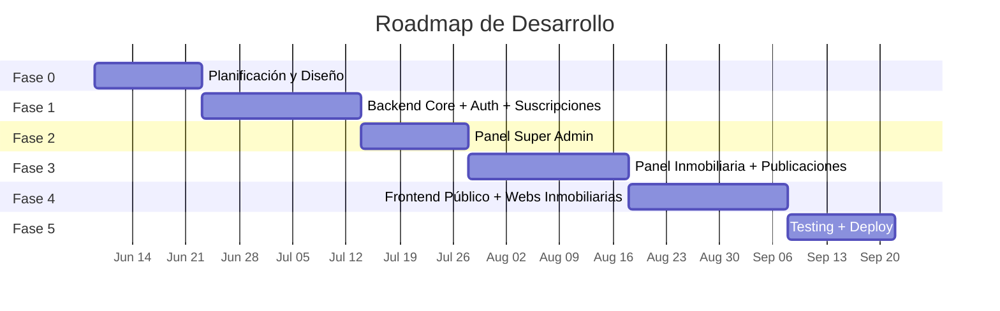

# 🏗️ Plan Estratégico — Plataforma Inmobiliaria Multitenancy

> **Versión**: 1.0 | **Fecha**: 6 junio 2026
> **Base**: Presupuesto v0.1 (7 may 2026) + Funcionalidades adicionales confirmadas
> **Documento de arquitectura**: [arquitectura.md](file:///c:/Users/Lucas/Desktop/plataforam-inmobiliaria-multitent/docs/arquitectura.md)

---

## 📊 Resumen Ejecutivo

| Concepto | Valor |
|----------|-------|
| **Producto** | Plataforma SaaS multitenancy para inmobiliarias |
| **Stack** | Node.js + Express + TypeScript (BE) / React + Vite (FE) / PostgreSQL + Prisma |
| **Horas totales** | **470h** |
| **Plazo** | **~15 semanas (~3.5 meses)** |
| **Sprints** | 2 semanas c/u, 6h/día lun-vie |
| **Inversión total** | ~$1.486.000 ARS |

### Alcance Confirmado
- ✅ Multitenancy con aislamiento por `tenant_id`
- ✅ Suscripciones con planes y límites (propiedades, usuarios, storage)
- ✅ Panel Super Admin (métricas globales, gestión de inmobiliarias y planes)
- ✅ Panel Inmobiliaria (propiedades, multimedia, agentes, leads)
- ✅ Frontend público con catálogo y búsqueda
- ✅ **Web propia por inmobiliaria** (carrousel + propiedades + branding)
- ✅ **Dominio propio por inmobiliaria** (SSL automático con Caddy + Let's Encrypt)
- ✅ Notificaciones por email (registro, suscripción, leads)
- ✅ Deploy con Docker Compose single-node

---

## 🗺️ Roadmap Visual



---

## 📋 Fases de Desarrollo

---

### FASE 0 — Planificación, Diseño UX/UI y Arquitectura
**Semanas 1-2 | 52 horas | Entrega: Semana 2**

#### Objetivos
Definir la arquitectura completa, diseñar todas las pantallas y establecer el sistema de diseño reutilizable.

#### Tareas

| # | Tarea | Horas | Prioridad |
|---|-------|-------|-----------|
| 0.1 | Inicializar monorepo (`backend/` + `frontend/`) + Docker Compose (PG) | 3h | 🔴 Crítica |
| 0.2 | Configurar linters, TypeScript, estructura de carpetas backend | 3h | 🔴 Crítica |
| 0.3 | Configurar Vite + React + TailwindCSS + estructura frontend | 3h | 🔴 Crítica |
| 0.4 | Diseñar schema de BD completo en Prisma (`schema.prisma`) | 6h | 🔴 Crítica |
| 0.5 | Diseño UX/UI: Paneles (Super Admin + Inmobiliaria) | 10h | 🟡 Alta |
| 0.6 | Diseño UX/UI: Web pública + catálogo + ficha propiedad | 8h | 🟡 Alta |
| 0.7 | Diseño UX/UI: Web propia por inmobiliaria (templates + carrousel) | 8h | 🟡 Alta |
| 0.8 | Design System: componentes base (Button, Input, Modal, Card, Table) | 6h | 🟡 Alta |
| 0.9 | Definir flujos de suscripción, roles y permisos (documento) | 3h | 🟡 Alta |
| 0.10 | Documentar API endpoints con OpenAPI/Swagger (borrador) | 2h | 🟢 Media |

#### Criterios de Aceptación
- [ ] Monorepo funcional con `npm run dev` levantando backend + frontend + PG
- [ ] `schema.prisma` con todas las tablas definidas y primera migración corrida
- [ ] Prototipo navegable (Figma o HTML estático) de todas las pantallas
- [ ] Design System con componentes base implementados en React

#### Entregable
Prototipo navegable + Documento de arquitectura + Repositorio inicializado

---

### FASE 1 — Backend Core, Autenticación y Suscripciones
**Semanas 3-5 | 108 horas | Entrega: Semana 5**

#### Objetivos
Construir toda la capa backend: servidor, autenticación JWT, roles, middleware de tenant, módulo de suscripciones y billing, y endpoints base para sitios y dominios.

#### Tareas

| # | Tarea | Horas | Prioridad | Módulo |
|---|-------|-------|-----------|--------|
| 1.1 | Setup Express + TypeScript + Zod + Pino + Helmet + CORS | 4h | 🔴 | `config/` |
| 1.2 | Validación de env vars con Zod (`env.ts`) | 2h | 🔴 | `config/` |
| 1.3 | Prisma client + seed inicial (plans, super_admin) | 4h | 🔴 | `config/` |
| 1.4 | `BaseRepository` tenant-aware (toda query exige `tenantId`) | 6h | 🔴 | `shared/repository/` |
| 1.5 | Middleware: `authenticate` (JWT verify) | 4h | 🔴 | `shared/middleware/` |
| 1.6 | Middleware: `authorize` (roles) + `requireTenant` | 3h | 🔴 | `shared/middleware/` |
| 1.7 | Middleware: resolución de tenant (subdominio/slug/JWT) | 5h | 🔴 | `shared/middleware/` |
| 1.8 | Módulo Auth: login, register, refresh, logout (JWT + bcrypt) | 10h | 🔴 | `modules/auth/` |
| 1.9 | Módulo Tenants: CRUD inmobiliarias (Super Admin) | 8h | 🔴 | `modules/tenants/` |
| 1.10 | Módulo Users: CRUD usuarios por tenant + chequeo límite | 6h | 🔴 | `modules/users/` |
| 1.11 | Módulo Subscriptions: planes, suscripciones, estados | 10h | 🔴 | `modules/subscriptions/` |
| 1.12 | `LimitService`: enforcement de límites por plan | 6h | 🔴 | `modules/subscriptions/` |
| 1.13 | Módulo Billing: interfaz `PaymentProvider` + webhooks | 10h | 🟡 | `modules/billing/` |
| 1.14 | Implementación Mercado Pago / Stripe (1 provider) | 6h | 🟡 | `modules/billing/` |
| 1.15 | Módulo Notifications: `EmailService` + templates | 6h | 🟡 | `modules/notifications/` |
| 1.16 | Rate limiting (login, registro, webhooks, endpoints públicos) | 3h | 🟡 | `shared/middleware/` |
| 1.17 | Error handling global (`AppError`, `NotFound`, `Forbidden`) | 3h | 🟡 | `shared/errors/` |
| 1.18 | Endpoints base para sitios web (`/api/sites/:slug/*`) | 8h | 🟡 | `modules/sites/` |
| 1.19 | Tabla `tenant_domains` + endpoints CRUD | 6h | 🟡 | `modules/domains/` |
| 1.20 | Servicio de verificación DNS (job periódico) | 5h | 🟡 | `modules/domains/` |
| 1.21 | Middleware resolución de tenant por `Host` header (dominios custom) | 6h | 🟡 | `shared/middleware/` |

#### Criterios de Aceptación
- [ ] Login/register funcional con JWT + refresh token en cookie httpOnly
- [ ] Roles super_admin, tenant_admin, agent operativos con permisos correctos
- [ ] Crear tenant → crear suscripción → aplicar límites del plan
- [ ] Webhook de pasarela procesa pagos y actualiza estado de suscripción
- [ ] Aislamiento de tenant verificado: un tenant NUNCA accede a datos de otro
- [ ] Endpoints de sitios y dominios funcionales

#### Entregable
API REST documentada con Swagger + ambiente de staging funcional

---

### FASE 2 — Panel de Administración General (Super Admin)
**Semanas 6-7 | 64 horas | Entrega: Semana 7**

#### Objetivos
Panel web completo para el Super Admin con métricas globales, gestión de inmobiliarias/planes, auditoría y gestión global de dominios.

#### Tareas

| # | Tarea | Horas | Prioridad |
|---|-------|-------|-----------|
| 2.1 | Layout Super Admin: sidebar, header, navegación | 6h | 🔴 |
| 2.2 | Dashboard: métricas globales (inmobiliarias activas, suscripciones, ingresos, MRR) | 10h | 🔴 |
| 2.3 | Gestión de inmobiliarias: listado + búsqueda + filtros | 8h | 🔴 |
| 2.4 | Gestión de inmobiliarias: crear, editar, suspender, asignar plan | 8h | 🔴 |
| 2.5 | Gestión de planes de suscripción: CRUD + precios | 6h | 🔴 |
| 2.6 | Módulo Audit backend: logs de acciones y accesos | 6h | 🟡 |
| 2.7 | Vista de auditoría: tabla con filtros (usuario, acción, fecha) | 6h | 🟡 |
| 2.8 | Módulo Analytics backend: métricas agregadas | 6h | 🟡 |
| 2.9 | Gestión global de dominios: listado + estados + override manual | 4h | 🟡 |
| 2.10 | Stores Zustand: auth, tenant, ui + interceptors Axios | 4h | 🔴 |

#### Criterios de Aceptación
- [ ] Super Admin ve métricas en tiempo real del estado de la plataforma
- [ ] Puede crear/editar/suspender inmobiliarias y asignarles planes
- [ ] Puede gestionar planes con precios y límites
- [ ] Logs de auditoría registran todas las acciones críticas
- [ ] Puede ver y gestionar dominios de todas las inmobiliarias

#### Entregable
Panel Super Admin operativo y conectado al backend

---

### FASE 3 — Panel de Inmobiliaria y Publicaciones
**Semanas 8-10 | 110 horas | Entrega: Semana 10**

#### Objetivos
Panel completo para cada inmobiliaria: dashboard propio, CRUD de propiedades con multimedia en alta calidad, gestión de agentes, leads, configuración de sitio web y dominio propio.

#### Tareas

| # | Tarea | Horas | Prioridad |
|---|-------|-------|-----------|
| 3.1 | Layout Panel Inmobiliaria: sidebar, header, navegación | 6h | 🔴 |
| 3.2 | Dashboard inmobiliaria: métricas propias (propiedades, vistas, leads) | 8h | 🔴 |
| 3.3 | Backend Properties: CRUD completo + estados (draft/published/paused/featured) | 10h | 🔴 |
| 3.4 | Frontend Properties: listado con filtros + tabla/grid switch | 8h | 🔴 |
| 3.5 | Frontend Properties: formulario crear/editar (React Hook Form + Zod) | 10h | 🔴 |
| 3.6 | Backend Media: pipeline de carga (presigned URL + procesamiento async) | 10h | 🔴 |
| 3.7 | Frontend Media: upload de imágenes drag&drop + preview + reordenar | 8h | 🔴 |
| 3.8 | Frontend Media: upload de video + thumbnail + estado processing/ready | 6h | 🟡 |
| 3.9 | Backend Inquiries: leads por propiedad + estados (new/contacted/closed) | 6h | 🟡 |
| 3.10 | Frontend Inquiries: bandeja de leads con filtros y acciones | 6h | 🟡 |
| 3.11 | Gestión de agentes/consultores por inmobiliaria | 6h | 🟡 |
| 3.12 | Sección "Mi Sitio Web": config visual (colores, textos, redes sociales) | 8h | 🟡 |
| 3.13 | Sección "Mi Sitio Web": editor de carrousel (agregar/reordenar/eliminar imágenes) | 8h | 🟡 |
| 3.14 | Sección "Dominio Propio": UI config + instrucciones DNS + estados | 4h | 🟡 |
| 3.15 | Preview en vivo del sitio web desde el panel | 4h | 🟢 |
| 3.16 | Vista de suscripción: plan actual, uso vs límites, upgrade | 6h | 🟡 |

#### Criterios de Aceptación
- [ ] CRUD completo de propiedades con todos los campos y estados
- [ ] Upload de imágenes y video con compresión, thumbnails y estado de procesamiento
- [ ] Leads llegan por formulario de contacto y se ven en la bandeja
- [ ] Inmobiliaria configura su sitio web (colores, carrousel, redes) y ve preview
- [ ] Inmobiliaria puede agregar dominio propio y ver estado de verificación
- [ ] Se visualiza uso actual vs límites del plan

#### Entregable
Panel de inmobiliaria completo + sistema de publicaciones y multimedia funcional

---

### FASE 4 — Frontend Público + Webs de Inmobiliarias
**Semanas 11-13 | 90 horas | Entrega: Semana 13**

#### Objetivos
Construir toda la cara pública: landing principal, catálogo general, web propia de cada inmobiliaria con carrousel y propiedades, ficha detallada, diseño responsive mobile-first.

#### Tareas

| # | Tarea | Horas | Prioridad |
|---|-------|-------|-----------|
| 4.1 | Landing page principal de la plataforma | 8h | 🔴 |
| 4.2 | Catálogo general con búsqueda avanzada y filtros | 10h | 🔴 |
| 4.3 | Ficha detallada de propiedad (galería, video, mapa, formulario contacto) | 10h | 🔴 |
| 4.4 | Web pública por inmobiliaria: header + carrousel hero | 8h | 🔴 |
| 4.5 | Web pública por inmobiliaria: grilla de propiedades con filtros | 8h | 🔴 |
| 4.6 | Web pública por inmobiliaria: tema dinámico (colores + branding del tenant) | 6h | 🔴 |
| 4.7 | Perfil público de inmobiliaria (info, redes, propiedades) | 6h | 🟡 |
| 4.8 | Formulario de contacto/consulta (genera lead → email al tenant) | 4h | 🟡 |
| 4.9 | SEO dinámico: meta tags por inmobiliaria y por propiedad | 4h | 🟡 |
| 4.10 | Integración con Caddy API para dominios verificados (SSL auto) | 6h | 🟡 |
| 4.11 | Routing completo: slug-based + subdominio + dominio custom | 6h | 🔴 |
| 4.12 | Diseño 100% responsive (mobile-first) en todas las vistas públicas | 8h | 🔴 |
| 4.13 | Integración de mapa (Google Maps / Leaflet) en ficha | 4h | 🟢 |
| 4.14 | Lazy loading de imágenes/videos + skeleton loaders | 2h | 🟢 |

#### Criterios de Aceptación
- [ ] Landing principal atractiva con buscador
- [ ] Catálogo filtra por ubicación, tipo, precio, ambientes
- [ ] Cada inmobiliaria tiene su web con carrousel, propiedades y branding propio
- [ ] Web funciona por slug, subdominio y dominio custom con SSL
- [ ] Ficha de propiedad con galería, video embebido, mapa y formulario
- [ ] Todo responsive y optimizado para mobile

#### Entregable
Sitio público completo + webs de inmobiliarias operativas

---

### FASE 5 — Testing, Deploy y Entrega Final
**Semanas 14-15 | 46 horas | Entrega: Semana 15**

#### Objetivos
Pruebas completas, optimización de rendimiento, deploy en producción y documentación.

#### Tareas

| # | Tarea | Horas | Prioridad |
|---|-------|-------|-----------|
| 5.1 | Tests unitarios (services, repositories, limit enforcement) | 8h | 🔴 |
| 5.2 | Tests de integración (auth flow, CRUD propiedades, billing webhooks) | 6h | 🔴 |
| 5.3 | Tests de aislamiento de tenant (un tenant nunca accede a otro) | 4h | 🔴 |
| 5.4 | Tests E2E: dominio custom → resolución → SSL → web correcta | 3h | 🟡 |
| 5.5 | Optimización de rendimiento (lazy loading, compresión, queries N+1) | 4h | 🟡 |
| 5.6 | Configuración Docker Compose producción (backend + frontend + PG + Caddy) | 6h | 🔴 |
| 5.7 | Deploy en servidor del cliente / cloud | 4h | 🔴 |
| 5.8 | Configuración Caddy producción (SSL, wildcard, dominios dinámicos) | 4h | 🟡 |
| 5.9 | Documentación técnica (README, env vars, deploy guide) | 3h | 🟡 |
| 5.10 | Manual de usuario (Super Admin + Admin Inmobiliaria) | 2h | 🟡 |
| 5.11 | Capacitación remota para administradores (1 sesión, 1 hora) | 1h | 🟡 |
| 5.12 | Smoke testing en producción | 1h | 🔴 |

#### Criterios de Aceptación
- [ ] Cobertura de tests en flujos críticos (auth, tenancy, billing, properties)
- [ ] Deploy en producción funcional y accesible
- [ ] SSL automático operativo para dominios custom
- [ ] Documentación técnica y manual de usuario entregados
- [ ] Capacitación realizada

#### Entregable
Plataforma en producción + documentación + 30 días de soporte post-entrega

---

## 🏛️ Arquitectura de Alto Nivel

```
┌─────────────────────────────────────────────────────────────┐
│                     CLIENTES (Browser)                       │
│   React + Vite — Paneles + Catálogo + Webs Inmobiliarias    │
└─────────────────────┬───────────────────────────────────────┘
                      │ HTTPS
                      ▼
┌─────────────────────────────────────────────────────────────┐
│              Caddy (reverse proxy + SSL automático)          │
│     Wildcard *.plataforma.com + dominios custom dinámicos   │
└─────────────────────┬───────────────────────────────────────┘
                      │
                      ▼
            ┌────────────────────┐        ┌──────────────────┐
            │  Backend Node.js   │ ─────→ │  S3/Cloudinary   │
            │  Express + TS      │ ─────→ │  SendGrid/Resend │
            │  (monolito modular)│ ─────→ │  MercadoPago     │
            └─────────┬──────────┘        └──────────────────┘
                      ▼
            ┌────────────────────┐
            │    PostgreSQL 16   │
            │  tenant_id en toda │
            │  tabla de negocio  │
            └────────────────────┘
```

---

## 🔑 Decisiones Técnicas Clave

| Decisión | Elección | Justificación |
|----------|----------|---------------|
| Multi-tenancy | Shared DB + `tenant_id` | Menor overhead, migraciones simples, reportes cross-tenant triviales |
| ORM | Prisma | Type-safe, migraciones, prevención SQL injection |
| Auth | JWT (15min) + Refresh cookie httpOnly | Seguridad vs XSS, stateless |
| Reverse Proxy | **Caddy** (no Nginx) | SSL automático para dominios dinámicos via API |
| Estado global FE | Zustand | Ligero, sin boilerplate |
| Validación | Zod (BE + FE) | Schemas compartidos, type inference |
| Multimedia | Presigned URLs → S3/Cloudinary | No pasa por el backend, escalable |
| Pago | Interfaz abstracta | Intercambiable entre MercadoPago y Stripe |

---

## ⚠️ Riesgos y Mitigaciones

| Riesgo | Impacto | Mitigación |
|--------|---------|------------|
| Integración pasarela de pago compleja | Retraso Fase 1 | Usar sandbox desde el inicio, implementar 1 provider primero |
| SSL dinámico para dominios custom | Fallo en Fase 4-5 | Caddy lo maneja nativamente; tener fallback a subdominio |
| Performance multimedia (videos grandes) | UX pobre | Presigned URLs directas a cloud, transcode delegado al provider |
| Aislamiento de tenant roto | Seguridad crítica | BaseRepository obligatorio, tests de aislamiento, code reviews |
| Scope creep (nuevas funcionalidades) | Retraso general | Todo fuera del alcance se cotiza aparte (cláusula en presupuesto) |

---

## 📌 Exclusiones (NO incluido)

- Dominio y hosting (provisto por el cliente)
- Costos de servicios de terceros (pasarela de pago, email, storage cloud)
- App móvil nativa
- Carga de contenido inicial (imágenes, textos, datos)
- Funcionalidades fuera de este documento → cotización aparte

---

## ✅ Próximo Paso Inmediato

> **FASE 0 — Sprint 1 (Semana 1-2)**
> 1. Inicializar monorepo con Docker Compose
> 2. Configurar backend (Express + TS + Prisma) y frontend (Vite + React)
> 3. Definir `schema.prisma` completo y correr primera migración
> 4. Comenzar diseño UX/UI en paralelo

**¿Arrancamos con la Fase 0?**
